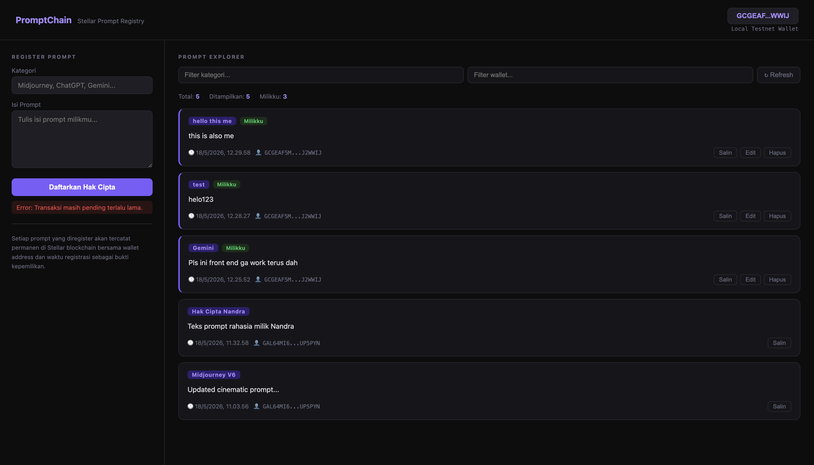

# PromptChain DApp
**PromptChain - The Immutable AI Prompt Registry & Ownership Ledger on Stellar**



Frontend preview of the current MVP.

## Project Structure

```text
soroban-prompt-registry/
├── README.md
├── index.html
├── fe-contoh.png
└── contracts/
   └── prompts/
      └── src/
         ├── lib.rs
         └── test.rs
```

## How It Works

1. The frontend loads the prompt registry from the Soroban contract.
2. The user connects a wallet or uses the local testnet wallet flow.
3. The user submits a prompt through the browser form.
4. The app sends a transaction to Stellar Testnet.
5. The contract stores, updates, or deletes the prompt on-chain.
6. The frontend refreshes the list so the latest registry is visible.

## Project Description
PromptChain is a decentralized smart contract built on the Stellar blockchain using the Soroban SDK. In the era of Generative AI, high-quality prompts are a new form of valuable source code. PromptChain provides a secure, immutable platform for Prompt Engineers and AI researchers to register their prompts, cryptographically proving their ownership and the exact time of creation.

By tying prompt data directly to a user's Stellar wallet address, the contract ensures that only the verified creator can update or delete their intellectual property, while allowing the public to transparently view and verify the registry.

## Project Vision
Our vision is to protect the intellectual property of AI creators by:
- **Establishing Proof of Authorship:** Tying every prompt to a cryptographic wallet address and an unforgeable blockchain timestamp.
- **Preventing Prompt Theft:** Creating a public ledger where creators can mathematically prove they were the first to engineer a specific prompt.
- **Decentralizing Knowledge:** Building a transparent, censorship-resistant library of AI instructions.
- **Empowering Creators:** Laying the foundation for a future where prompt engineers can safely license, sell, or receive tips for their AI workflows.

## Key Features
1. **Immutable Prompt Registration**
   - Register AI prompts (e.g., Midjourney, ChatGPT, Claude) with a category and content.
   - Automatically captures the exact ledger timestamp.
   - Binds the prompt permanently to the creator's wallet owner address.
   - Auto-generates a unique ID for each record.

2. **Cryptographic Access Control**
   - Utilizes Soroban's `require_auth()` to ensure strict security.
   - Modifying or deleting a prompt is mathematically impossible unless the transaction is signed by the original creator's wallet.

3. **Transparent Public Registry**
   - Fetch all registered prompts globally in a single call.
   - Allows anyone to verify the true owner and creation date of a valuable prompt.

4. **Flexible Management**
   - **Update:** Creators can refine their prompt content or category over time while retaining their original timestamp and ID.
   - **Delete:** Creators maintain the right to securely erase their prompt data from the blockchain if desired.

## Contract Details
- **Contract Address:** `CDKJVAGH3ZUTRII7LMA2S7H236HFYCCTVYGBJJLNEKYQF7R3JNZZFNBB`
- **Network:** Stellar Testnet

## Future Scope

### Short-Term Enhancements
- **Prompt Tipping:** Allow users to send USDC or XLM tips directly to the owner address of a prompt they found useful.
- **Frontend UI/UX:** Build a web-based explorer where users can connect Freighter Wallet to register and browse prompts visually.
- **Pagination:** Implement pagination for `get_prompts` to handle massive amounts of data efficiently.

### Medium-Term Development
- **Prompt Marketplace:** Introduce smart contract logic to allow users to buy, sell, or transfer ownership (owner address) of premium prompts.
- **Private Prompts:** Integrate zero-knowledge proofs or asymmetric encryption so the prompt content is hidden, but the proof of ownership remains public.
- **On-Chain Licensing:** Allow creators to attach specific open-source or commercial licenses to their prompt records.

### Long-Term Vision
- **AI Oracle Verification:** Integrate with off-chain AI agents to automatically run and verify the output quality of a registered prompt before it gets added to a "Premium" tier.
- **Cross-Chain Interoperability:** Allow prompts registered on Stellar to be referenced or utilized by dApps on other networks.

## Technical Requirements
- Soroban SDK
- Rust Programming Language
- Stellar CLI

## Getting Started
Deploy the smart contract to Stellar's Soroban network and interact with it using the four main functions. Ensure you have your Stellar CLI configured with an identity (e.g., `nandra`).

### 1. Register a Prompt
```bash
stellar contract invoke --id CDKJVAGH3ZUTRII7LMA2S7H236HFYCCTVYGBJJLNEKYQF7R3JNZZFNBB --source nandra --network testnet -- register_prompt --owner nandra --category "Midjourney" --content "Cinematic portrait, golden hour, 8k --ar 16:9"
```

### 2. View All Prompts
```bash
stellar contract invoke --id CDKJVAGH3ZUTRII7LMA2S7H236HFYCCTVYGBJJLNEKYQF7R3JNZZFNBB --source nandra --network testnet -- get_prompts
```

### 3. Update a Prompt
*(Requires the `id` from `get_prompts` and must be signed by the original owner)*
```bash
stellar contract invoke --id CDKJVAGH3ZUTRII7LMA2S7H236HFYCCTVYGBJJLNEKYQF7R3JNZZFNBB --source nandra --network testnet -- update_prompt --owner nandra --id <INSERT_ID_HERE> --new_category "Midjourney V6" --new_content "Updated cinematic prompt..."
```

### 4. Delete a Prompt
*(Requires the `id` and must be signed by the original owner)*
```bash
stellar contract invoke --id CDKJVAGH3ZUTRII7LMA2S7H236HFYCCTVYGBJJLNEKYQF7R3JNZZFNBB --source nandra --network testnet -- delete_prompt --owner nandra --id <INSERT_ID_HERE>
```

---
> **PromptChain - Securing the DNA of Generative AI on the Blockchain.**